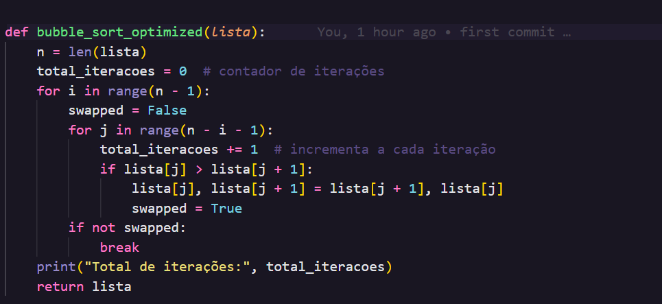

# 🟦 Otimização do Bubble Sort em Python

Implementação do **algoritmo Bubble Sort** otimizado em Python.

---

## 📌 Descrição

A versão **Otimizada do Bubble Sort** adiciona uma flag (normalmente chamada de trocou, swapped ou algo parecido).
Essa flag é usada para verificar se houve alguma troca na última passada pelo vetor.

Se não houve troca, significa que o vetor já está ordenado → o algoritmo pode parar mais cedo.

---

## ⚡ Funcionamento da flag

-Antes de cada passada, define trocou(swapped) = False.

-A cada comparação, se precisar trocar dois elementos → trocou = True.

## Ao final da passada, verifica:

-Se trocou(swapped)  == False → o vetor já está ordenado → encerra.

-Caso contrário → continua para a próxima passada.

## Adição da variável total_iteracoes no Bubble Sort otimizado
A variável *total_iteracoes* serve para contar quantas vezes o algoritmo fez comparações entre elementos da lista.
Cada vez que o loop interno verifica if lista[j] > lista[j + 1] é uma iteração.
Contar as iterações ajuda a analisar o desempenho do algoritmo:
Quanto mais iterações, mais trabalho o algoritmo fez.
No Bubble Sort otimizado, se a lista estiver quase ordenada, o número de iterações será menor do que no Bubble Sort simples, porque ele interrompe a execução cedo.

---

## 🚀 Testes 

### Teste 1:
* Tempo de execução (Bubble Sort Simples) : 0.0002 segundos
* Total de iterações: 45
* Tempo de execução (Bubble Sort Otimizado) : 0.0002 segundos
* Total de iterações: 42
  
  

### Teste 2:
* Tempo de execução (Bubble Sort Simples) : 0.0003 segundos
* Total de iterações: 55
* Tempo de execução (Bubble Sort Otimizado) : 0.0002 segundos
* Total de iterações: 34
  
  

### Teste 3:
* Tempo de execução (Bubble Sort Simples) : 0.0005 segundos
* Total de iterações: 120
* Tempo de execução (Bubble Sort Otimizado) : 0.0003 segundos
* Total de iterações: 114
  
  
  

 ## 🔹 Vantagens do Bubble Sort Otimizado

 * Menos iterações desnecessárias → quando os dados já estão quase ordenados, ele pode parar muito mais cedo.
 * Melhor desempenho em casos práticos → embora ambos tenham complexidade O(n²) no pior caso, o otimizado melhora bastante em casos favoráveis (quase 
 ordenados).
 * Uso da flag como controle inteligente → traz eficiência sem mudar a lógica principal do algoritmo.

 ## 🔹 Conclusão e Explicação
 O Bubble Sort Simples sempre percorre todo o vetor em todas as iterações, mesmo que os elementos já estejam ordenados antes do final. 
 Isso faz com que ele execute mais comparações e trocas desnecessárias, aumentando o tempo de execução em alguns casos.

 **Já o Bubble Sort Otimizado com flag introduz uma melhoria:**

 A cada passagem pelo vetor, ele verifica se alguma troca foi feita.
 Se nenhuma troca aconteceu, significa que o vetor já está ordenado e o algoritmo pode parar imediatamente, evitando iterações desnecessárias.
 Ou seja, o otimizado evita trabalho desnecessário, enquanto o simples continua rodando até o fim sempre
