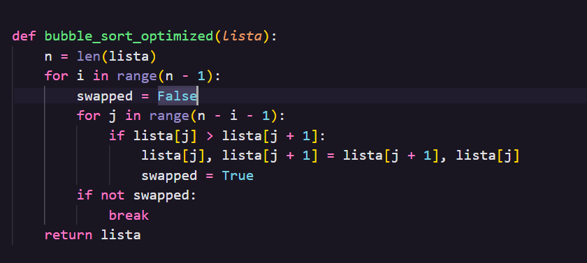
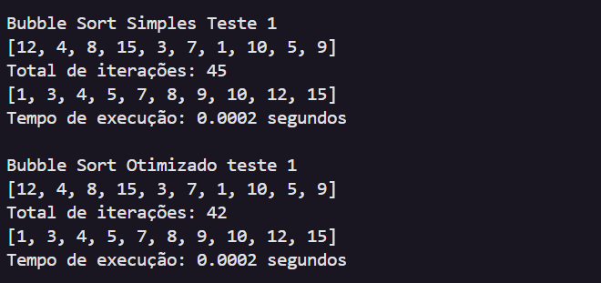
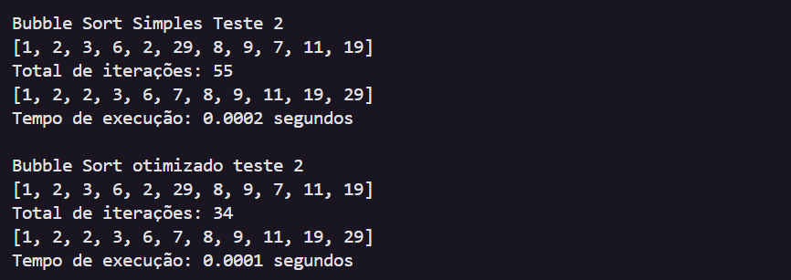

# 🟦 Otimização do Bubble Sort em Python

Implementação do **algoritmo Bubble Sort** otimizado em Python.

---

## 📌 Descrição

A versão **Otimizada do Bubble Sort** adiciona uma flag (normalmente chamada de trocou, swapped ou algo parecido).
Essa flag é usada para verificar se houve alguma troca na última passada pelo vetor.

Se não houve troca, significa que o vetor já está ordenado → o algoritmo pode parar mais cedo.

---

## ⚡ Funcionamento da flag

-Antes de cada passada, define trocou(swapped) = False.

-A cada comparação, se precisar trocar dois elementos → trocou = True.

## Ao final da passada, verifica:

-Se trocou(swapped)  == False → o vetor já está ordenado → encerra.

-Caso contrário → continua para a próxima passada.

---

## 🚀 Testes 

### Teste 1:
* Tempo de execução (Bubble Sort Simples) : 0.0002 segundos
* Tempo de execução (Bubble Sort Otimizado) : 0.0001 segundos
  
  

### Teste 2:
* Tempo de execução (Bubble Sort Simples) : 0.0002 segundos
* Tempo de execução (Bubble Sort Otimizado) : 0.0001 segundos
  
  

### Teste 3:
* Tempo de execução (Bubble Sort Simples) : 0.0003 segundos
* Tempo de execução (Bubble Sort Otimizado) : 0.0002 segundos
  
  
 
